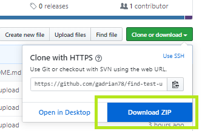

## Requirements:

There might be other dependencies, these are the ones I have thought of:
I have Python 3.7.4 installed and didn't make a point to test the code on a legacy version of Python.

**Beem (and dependencies)**
You can find installation instructions [here](https://beem.readthedocs.io/en/latest/installation.html).

**Python-DotEnv**
You also need the [Python-DotEnv](https://pypi.org/project/python-dotenv/) package, to make the code run without hardcoding your private posting key.

## Some usage details:

1. Install the requirements, if you don't have them already.

2. Click on the green 'Clone or Download' button and then choose 'Download Zip', like in this image:

After the zipped files are downloaded, upzip them in a directory of your convenience on your computer.

3. You need to add you private posting key (or keys) to the <code>dotenv.env</code> file. **Do not share this file with anyone!**

4. You should be now able to run this small Python code. Write <code>python find_urls_in_posts.py</code> from a terminal window in the directory where you saved the unzipped downloaded code.

This will execute a sample (for 20 posts) of a full options ON script. There are a number of <code>script_params_*</code> files which I created by default. Each contains a different set of combinations for the parameters. All you have to do to use any of them is to uncomment the corresponding <code>import</code> line in <code>find_urls_in_posts.py</code> (and comment the previous uncommented line).

You can customize anything you want, if you know what you're doing. You most likely can write better code, if you are experienced with Python. Most script params are in these <code>script_params_*</code> files, but the node to use (which determines if Steem or Hive is used to get posts) and the author name are set in <code>find_urls_in_posts.py</code>.

I wrote a post on the Hive blockchain with [additional details](https://peakd.com/hive-139531/@gadrian/python-script-to-find-and-test-urls-in-your-hive-or-steem-posts).
